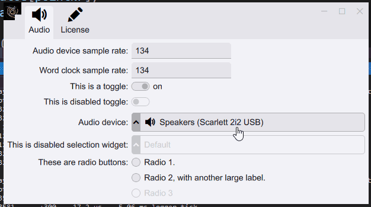

TTauri GUI library
==================

A portable, low latency, retained-mode GUI library written in C++.

Motivation
----------
I started this library to make a portable, low latency and modern looking
UI framework, which may also be used in proprietary (closed source) applications.

It is specifically designed to display information with low-latency,
and at the screen's refresh rate. Special care is taken for making
it easy for GUI element to observe and modify data external to the GUI.

Features
--------

 - Retained-mode GUI, implemented as a game setup-update-draw loop.
 - Modern C++20 library.
 - Animation at the screen's refresh rate.
 - Information is displayed at low latency.
 - Most or all drawing is GPU accellerated, using a Vulkan backend.
 - Text is drawn using subpixel anti-aliasing and proper kerning.
 - High dynamic range and high gamut color handling.
 - High level API to make simple desktop or mobile applications.
 - Themes, including light/dark support.
 - Editable key-bindings.
 - Localization and translation.
 - Automatic application preferences storage.

Platform support
----------------

The following platforms are supported:
 - MSVC - Windows 10 - x64

Installation
------------
For installation instructions see the minimum example of a project that
includes ttauri as a submodule at:
<https://github.com/ttauri-project/ttauri_hello_world>

Sponsors
--------
The following people and companies are platinum sponsors:

_There are currently no platinum sponsors._

for more sponsers please see [SPONSORS](SPONSORS.md).

