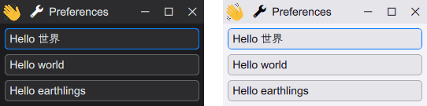
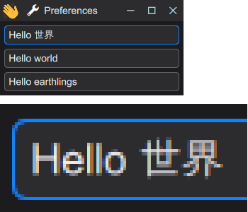

HikoGUI GUI library [](https://github.com/hikogui/hikogui/actions/workflows/build-on-windows.yml) [](https://github.com/hikogui/hikogui/releases/latest) [](https://github.com/hikogui/hikogui/blob/main/LICENSE_1_0.txt)
==================

A portable, low latency, retained-mode GUI framework written in C++
-------------------------------------------------------------------

I started this library to make a portable, low latency and modern looking
UI framework, which may also be used in proprietary (closed source) applications.

It is specifically designed to display information with low-latency,
and at the screen's refresh rate. Special care is taken for making
it easy for GUI element to observe and modify data external to the GUI.

You can find a lot more information,
[documentation](https://hikogui.org/docs/hikogui/main/index.html),
[example code](https://github.com/hikogui/hikogui-hello-world/blob/main/src/main.cpp),
news and blog posts on the main web site: <https://hikogui.org/>

Features
--------

 - High level API to make simple desktop applications.
 - Modern C++20 library.
 - Retained-mode GUI.
 - GUI will dynamically track the state of the application.
 - Localization and translation.
 - Animation at the screen's refresh rate.
 - Themes; including light/dark support.
 - Editable key-bindings.



 - Most or all drawing is GPU accelerated with Vulkan.
 - Text is drawn using kerning, perceptional correct blending and subpixel anti-aliasing.
 - High dynamic range and high gamut color handling.



 - Automatic application preferences storage.
 - Many support systems:
   + logging,
   + statistics,
   + text handling,
   + text template language,
   + expression language,
   + dynamic type system.

Example
-------
Here is some example code for an application with three radio buttons,
who form a set by sharing a single `value` observer.

```
int hi_main(int argc, char *argv[])
{
    observer<int> value = 0;

    auto gui = hi::gui_system::make_unique();
    auto &window = gui.make_window(tr("Radio button example"));
    window.content().make_widget<label_widget>("A1", tr("radio buttons:"));
    window.content().make_widget<radio_button_widget>("B1", tr("one"), value, 1);
    window.content().make_widget<radio_button_widget>("B2", tr("two"), value, 2);
    window.content().make_widget<radio_button_widget>("B3", tr("three"), value, 3);

    return gui->loop();
}
```

Platform support
----------------

The following platforms are supported:

 - MSVC - Windows 10 (or newer) - x64

For hardware support see: [hardware\_support](docs/hardware_support.md)

Installation, Building and Contributing
---------------------------------------

You can find the install and build instruction for your favorite IDE
in the [INSTALL.md](INSTALL.md) document.

You can find instruction on how to contribute to the HikoGUI library in the
[CONTRIBUTING.md](CONTRIBUTING.md) document.

If you want to use HikoGUI as a library for your own application you can
find instructions in the [hikogui_hello_world](https://github.com/hikogui/hikogui_hello_world)
example application's [README](https://github.com/hikogui/hikogui_hello_world/blob/main/README.md).

Sponsors
--------

If you like to become a sponsor, please contribute to
[Take Vos](https://github.com/sponsors/takev) the main developer of the HikoGUI.

The following people and companies are platinum sponsors:

_There are currently no platinum sponsors._

For more sponsors please see [SPONSORS](SPONSORS.md).

